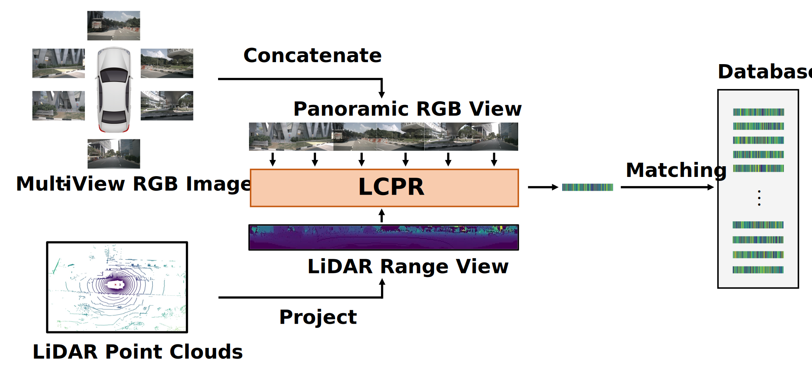

# LCPR
## Introduction
This repository is the official implementation of [our paper:](https://arxiv.org/pdf/2311.03198.pdf)
>LCPR: A Multi-Scale Attention-Based LiDAR-Camera Fusion Network for Place Recognition.
>[Zijie Zhou](https://github.com/ZhouZijie77), [Jingyi Xu](https://github.com/BIT-XJY/), Guangming Xiong, [Junyi Ma*](https://github.com/BIT-MJY)


Sensor fusion has been considered an effective method to overcome the weaknesses of individual sensors. Most existing multimodal place recognition methods only use limited field-of-view camera images, which leads to an imbalance between features from different modalities and limits the effectiveness of sensor fusion. Thus, we propose a novel multimodal place recognition neural network LCPR. It takes multi-view RGB images and LiDAR range images as input, extracts discriminative and yaw-rotation invariant global descriptors for fast query-database matching. 

## Table of Contents
1. [Introduction](#LCPR)
2. [Install](#install)
3. [Data Preparation](#data-preparation)
4. [Training](#training)
5. [Evaluation](#evaluation)
6. [Download](#download)
7. [Citation](#citation)


## Install
- Ubuntu 20.04 + Python 3.8
- PyTorch 1.12.1 + CUDA 11.8
```
git clone https://github.com/ZhouZijie77/LCPR.git
cd LCPR
conda create -n lcpr python=3.8
conda activate lcpr
pip install -r requirements.txt
```
## Data Preparation
- Please download the offical [nuScenes dataset](https://www.nuscenes.org/nuscenes).
- Generate the infos and range data needed to run the code.
```bash
cd tools
python gen_info.py
python gen_index.py
python gen_range.py
cd ..
```
- The final data structure should be like:
```
nuScenes
├─ samples
│    ├─ CAM_BACK
│    ├─ CAM_BACK_LEFT
│    ├─ CAM_BACK_RIGHT
│    ├─ CAM_FRONT
│    ├─ CAM_FRONT_LEFT
│    ├─ CAM_FRONT_RIGHT
│    ├─ LIDAR_TOP
│    ├─ RANGE_DATA
├─ sweeps
│    ├─ ...
├─ maps
│    ├─ ...
├─ v1.0-test
│    ├─ attribute.json
│    ├─ calibrated_sensor.json
│    ├─ ...
├─ v1.0-trainval
│    ├─ attribute.json
│    ├─ calibrated_sensor.json
│    ├─ ...
├─ nuscenes_infos-bs.pkl
├─ nuscenes_infos-shv.pkl
├─ nuscenes_infos-son.pkl
├─ nuscenes_infos-sq.pkl
├─ bs_db.npy
├─ bs_test_query.npy
├─ bs_train_query.npy
├─ bs_val_query.npy
├─ shv_db.npy
├─ shv_query.npy
├─ son_db.npy
├─ son_query.npy
├─ sq_db.npy
├─ sq_test_query.npy
└─ sq_train_query.npy
```

## Training
First you need to set the file paths in `config/config.yaml`. Then, run the following script to train the model:
```bash
python train.py
```

## Evaluation
Set the model path that you need to load in `test.py`. Then run the script:
```bash
python test.py
```
## Download
You can download our pre-trained models from this [link](https://drive.google.com/drive/folders/1TRLEQWTa4tL4x9JDgQ4NvYmg8dN86U4X?usp=drive_link).

## Citation
If you use our code in your academic work, please cite our paper:
```
@misc{zhou2023lcpr,
      title={LCPR: A Multi-Scale Attention-Based LiDAR-Camera Fusion Network for Place Recognition}, 
      author={Zijie Zhou and Jingyi Xu and Guangming Xiong and Junyi Ma},
      year={2023},
      eprint={2311.03198},
      archivePrefix={arXiv},
      primaryClass={cs.CV}
}
```
